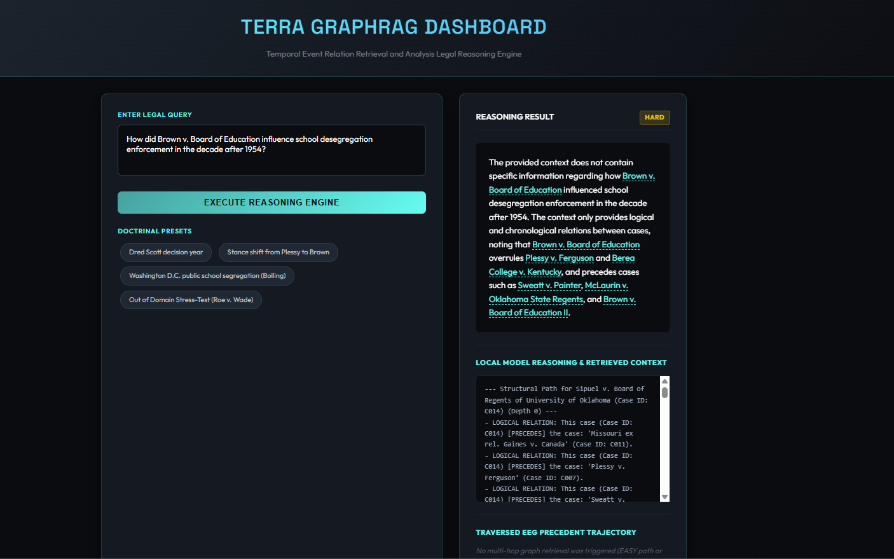
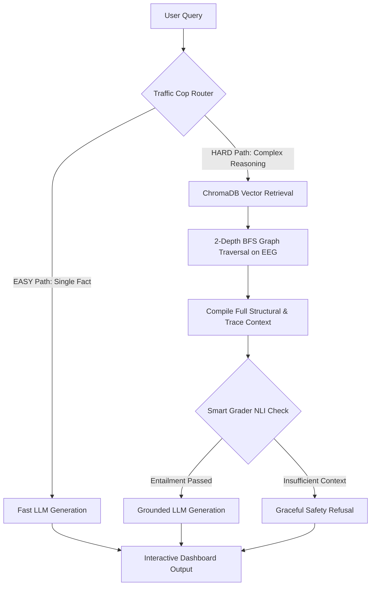

# TERRA: Temporal Event Relation Retrieval and Analysis GraphRAG

[](https://www.python.org/)
[](https://fastapi.tiangolo.com/)
[](https://www.trychroma.com/)
[](https://networkx.org/)
[](LICENSE)

**TERRA** (*Temporal Event Relation Retrieval and Analysis*) is an advanced **GraphRAG legal reasoning engine** designed for tracking precedent evolution, multi-hop citation graph traversal, and zero-hallucination legal inference. It combines structured **Event Evolution Graphs (EEG)** with vector-based thinking trace indexing and NLI semantic quality grading.

---

## 🖥️ Web UI Dashboard Preview



*The interactive dark-mode dashboard (`http://127.0.0.1:8000`) showing the Traffic Cop intent classification, grounded legal answer with hyperlinked precedent cases, local model step-by-step reasoning & retrieved context, and citation trajectory paths.*

---

## ✨ Key System Features

- 🚦 **Traffic Cop Intent Router**: Dynamically classifies queries into **EASY** (direct fast-path factual lookup) or **HARD** (deep multi-hop RAG path), optimizing latency and compute resources.
- 🕸️ **Event Evolution Graph (EEG)**: A NetworkX directed citation graph linking legal precedents with authentic cross-citations (e.g., `Brown v. Board of Education` `[OVERRULES]` `Plessy v. Ferguson`).
- 🧠 **Reasoning-Trace Vector Index**: ChromaDB vector store indexing step-by-step legal thinking traces for landmark Supreme Court cases.
- ⚖️ **Smart Grader (NLI Entailment)**: Evaluates whether retrieved legal context logically entails the required answer before LLM generation, preventing hallucinations and enforcing graceful safety refusals for out-of-domain queries.
- 🦙 **100% Offline Local LLM & Cloud Support**: Native support for running completely offline with local models via **Ollama** (e.g., Gemma, Llama, DeepSeek) as well as cloud API providers (Google Gemini, OpenAI, OpenRouter).
- 🛡️ **Sanitized & Secure Interface**: Built-in HTML sanitization protecting against Cross-Site Scripting (XSS) and thread-safe bounded in-memory caching.

---

## 🏗️ Architecture & Pipeline Workflow



---

## 🚀 Quick Start Guide

### 1. Prerequisites & Installation

Ensure Python 3.10+ is installed. Clone the repository and install required dependencies:

```bash
git clone https://github.com/zaforsaadik7/TERRA-Temporal-Evolution-and-Reasoning-Trace-RAG.git
cd TERRA-Temporal-Evolution-and-Reasoning-Trace-RAG
pip install -r requirements.txt
```

### 2. Environment Configuration (`.env`)

Copy the template environment file to `.env`:

```bash
cp .env.example .env
```

Configure your `.env` based on your execution preference:

#### Option A: Running 100% Locally with Ollama (Recommended for Offline Mode)
Make sure [Ollama](https://ollama.com/) is installed and running locally on port `11434`:
```env
OPENAI_API_KEY=ollama
OLLAMA_MODEL=hf.co/unsloth/gemma-4-12b-it-GGUF:Q4_K_M
USE_LOCAL_OLLAMA=true
```

#### Option B: Running with Cloud API Providers (Gemini / OpenAI / OpenRouter)
```env
GEMINI_API_KEY=your_gemini_api_key_here
OPENAI_API_KEY=your_openai_api_key_here
GOOGLE_JUDGE_API_KEY=your_google_judge_api_key_here
```

---

## 💻 Usage Instructions

### Step 1: Ingest Caselaw & Build EEG Knowledge Graph
Build the Event Evolution Graph index (`terra_eeg_index.json`) and populate ChromaDB vector store:
```bash
python ingest_and_build.py
```

### Step 2: Launch the Web UI Dashboard
Start the FastAPI server and interactive dashboard:
```bash
python app.py
```
Open your browser and navigate to: **`http://127.0.0.1:8000`**

### Step 3: Run Terminal CLI Queries (Optional)
Execute standalone queries via the command-line inference engine:
```bash
python ask_terra.py
```

### Step 4: Run Comparative Evaluation Suite
Run the 35-query comparative benchmark across 3 pipelines (TERRA GraphRAG vs Flat RAG vs Direct LLM):
```bash
python eval_terra.py
```

---

## 📂 Repository Structure

| File / Directory | Description |
| :--- | :--- |
| [`app.py`](file:///d:/App%20Development/TERRA-RAG%20project/TERRA-Temporal-Evolution-and-Reasoning-Trace-RAG/app.py) | FastAPI web server serving the dark-mode dashboard UI & API endpoints. |
| [`ask_terra.py`](file:///d:/App%20Development/TERRA-RAG%20project/TERRA-Temporal-Evolution-and-Reasoning-Trace-RAG/ask_terra.py) | Core GraphRAG inference engine, Traffic Cop Intent Router, and Smart Grader. |
| [`ingest_and_build.py`](file:///d:/App%20Development/TERRA-RAG%20project/TERRA-Temporal-Evolution-and-Reasoning-Trace-RAG/ingest_and_build.py) | Ingestion pipeline extracting citations with `eyecite` and building NetworkX graph & ChromaDB. |
| [`eval_terra.py`](file:///d:/App%20Development/TERRA-RAG%20project/TERRA-Temporal-Evolution-and-Reasoning-Trace-RAG/eval_terra.py) | Benchmark evaluation suite (35 queries, ROUGE-L, faithfulness, relevance, latency). |
| [`sample_terra_queries.md`](file:///d:/App%20Development/TERRA-RAG%20project/TERRA-Temporal-Evolution-and-Reasoning-Trace-RAG/sample_terra_queries.md) | Structured test suite of 55 benchmark queries across 5 difficulty categories. |
| [`graph_analytics.py`](file:///d:/App%20Development/TERRA-RAG%20project/TERRA-Temporal-Evolution-and-Reasoning-Trace-RAG/graph_analytics.py) | Computes publication-grade graph metrics (density, degree distribution, centralities). |
| [`audit_graph.py`](file:///d:/App%20Development/TERRA-RAG%20project/TERRA-Temporal-Evolution-and-Reasoning-Trace-RAG/audit_graph.py) | Audits node connectivity and citation edges in `terra_eeg_index.json`. |
| [`rejudge_failed.py`](file:///d:/App%20Development/TERRA-RAG%20project/TERRA-Temporal-Evolution-and-Reasoning-Trace-RAG/rejudge_failed.py) | Re-evaluates benchmark records with low faithfulness scores using independent models. |
| [`watch_progress.py`](file:///d:/App%20Development/TERRA-RAG%20project/TERRA-Temporal-Evolution-and-Reasoning-Trace-RAG/watch_progress.py) | CLI live progress dashboard monitoring evaluation suite execution. |
| [`view_traces.py`](file:///d:/App%20Development/TERRA-RAG%20project/TERRA-Temporal-Evolution-and-Reasoning-Trace-RAG/view_traces.py) | Utility script to inspect thinking traces stored in ChromaDB. |
| [`tests/test_engine.py`](file:///d:/App%20Development/TERRA-RAG%20project/TERRA-Temporal-Evolution-and-Reasoning-Trace-RAG/tests/test_engine.py) | Unit test suite verifying JSON stripping, safety refusal matching, and bounded cache. |
| `image.png` | UI Dashboard screenshot demonstrating live reasoning, RAG context, and precedent paths. |

---

## 📊 Benchmark & Test Queries

For structured evaluation, refer to [`sample_terra_queries.md`](file:///d:/App%20Development/TERRA-RAG%20project/TERRA-Temporal-Evolution-and-Reasoning-Trace-RAG/sample_terra_queries.md) containing 55 test queries divided into:
1. 🟢 **Category 1**: Factual & Single-Point Lookups (`EASY` Path)
2. 🔵 **Category 2**: Temporal Evolution & Multi-Hop Reasoning (`HARD` Path)
3. 🟣 **Category 3**: Precedent Overruling & Reversal Queries
4. 🔴 **Category 4**: Out-of-Domain Safety & Refusal Guardrails
5. 🟡 **Category 5**: Adversarial & Trick Queries

---

## 👨‍💻 Author & Attribution

Developed & Maintained by **Md. Emam Zafor Saadik And Muhammad Raihan Molla** ([@zaforsaadik7](https://github.com/zaforsaadik7)), ([@raihan12121](https://github.com/raihan12121)) 

---

## 📜 License

This repository is open-source and released under the [MIT License](LICENSE).
