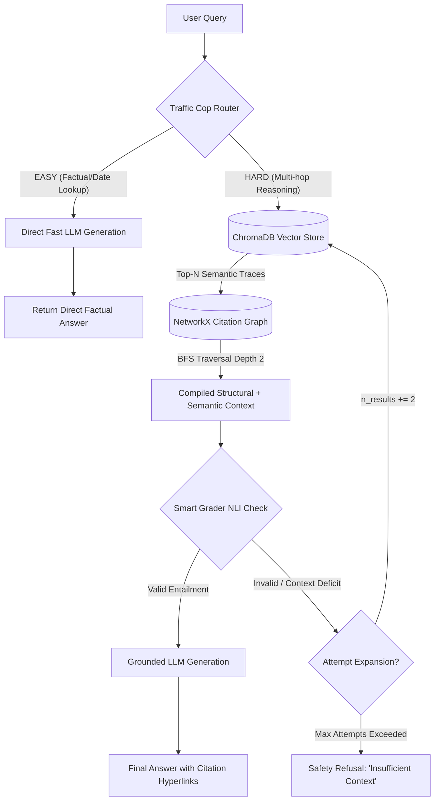
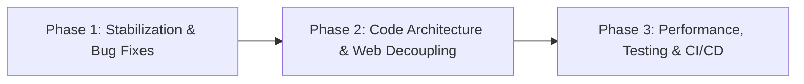

# TERRA Framework: System Architecture & Recommended Improvements

**Project Name**: TERRA (Temporal-Evolution and Reasoning-Trace RAG)  
**Repository**: `raihan12121/TERRA-Temporal-Evolution-and-Reasoning-Trace-RAG`  
**Date**: July 25, 2026  
**Document Purpose**: Comprehensive technical overview of how TERRA operates, its component architecture, data flow, and an actionable roadmap for system improvements.

---

## 1. Executive Overview

**TERRA** is a hybrid GraphRAG framework designed for complex legal reasoning across evolving precedent in U.S. Supreme Court Civil Rights constitutional law (1857–1971). Standard RAG architectures fail on legal citation networks because legal doctrines evolve over time (*Plessy v. Ferguson* (1896) $\rightarrow$ *Sweatt v. Painter* (1950) $\rightarrow$ *Brown v. Board of Education* (1954)).

TERRA addresses this by combining **dense semantic vector retrieval** with **topological graph traversal**, guarded by an intent router and a Natural Language Inference (NLI) entailment checker.

---

## 2. How TERRA Works: End-to-End Pipeline

### Detailed Processing Steps

1. **Ingestion & Citation Extraction (`ingest_and_build.py`)**:
   - Parses 34 landmark SCOTUS cases and 366 synthetic cases using `eyecite` to extract authentic U.S. Reporter citation strings (e.g., `347 U.S. 483`).
   - Builds an **Event Evolution Graph (EEG)** using NetworkX (persisted to `terra_eeg_index.json`) storing explicit edges (`PRECEDES`, `OVERRULES`, `DISTINGUISHES`).
   - Generates vector embeddings into ChromaDB (`./terra_vector_db`) for dense semantic search.

2. **Dynamic Intent Routing — "Traffic Cop" (`ask_terra.py`)**:
   - **`EASY`**: Single-point factual questions (e.g., *"In what year was Plessy v. Ferguson decided?"*). Bypasses RAG to eliminate unnecessary vector search and LLM overhead.
   - **`HARD`**: Multi-hop reasoning, doctrinal evolution, or out-of-domain queries. Activates the deep GraphRAG pipeline.

3. **Graph Trajectory Traversal (`ask_terra.py` $\rightarrow$ `extract_graph_context`)**:
   - For `HARD` queries, queries ChromaDB for seed semantic matches.
   - Executes a 2-depth Breadth-First Search (BFS) on the NetworkX graph to retrieve predecessors (older cited cases) and successors (subsequent overruling/amplifying cases).

4. **Semantic Entailment Verification — "Smart Grader" (`ask_terra.py`)**:
   - Passes query and compiled context to an NLI grader to verify if the retrieved context logically *entails* answerability.
   - If context is incomplete, expands search (`n_results += 2`) and retries. If validation fails, triggers a graceful safety refusal to eliminate hallucinations.

5. **Grounded Generation with Precedent Hyperlinking (`ask_terra.py`)**:
   - Synthesizes the final answer strictly bound to the validated context.
   - Formats case references into clickable markdown links (`[Brown v. Board of Education](/case/C019)`).

6. **Web API & Interactive Dashboard (`app.py`)**:
   - Exposes FastAPI endpoints (`/query`, `/explain`, `/case/{case_id}`) and serves a dark-mode Web UI dashboard.

---

## 3. Codebase Component Status Matrix

| File / Component | Responsible Functionality | Current Status | Key Considerations |
| :--- | :--- | :--- | :--- |
| `app.py` | FastAPI server, API endpoints, HTML UI | **Functional** | Embedded single-file HTML string (`HTML_CONTENT`), unbounded in-memory cache, synchronous disk I/O logging. |
| `ask_terra.py` | Inference engine, Traffic Cop, Smart Grader, BFS traversal | **Functional** | Model alias mapping string translation table (`gemma` $\rightarrow$ `gpt-4o`), global singleton imports. |
| `ingest_and_build.py` | Graph construction, `eyecite` citation parsing, ChromaDB builder | **Functional** | Windows C-extension fallback mocking (`sys.modules['fast_diff_match_patch'] = MagicMock()`). |
| `eval_terra.py` | 35-query benchmark evaluation harness | **Functional** | Evaluates Faithfulness, Relevance, ROUGE-L, Safety Rejection, and Wilcoxon statistical significance. |
| `graph_analytics.py` | Topological graph analysis | **Functional** | Outputs degree distribution, hub analysis, clustering coefficients to `terra_graph_metrics.json`. |
| `rejudge_failed.py` | Score re-evaluation script | **Flawed** | Line 129 passes `context=""` during re-judging, distorting RAG faithfulness scores. |
| `stress_test.py` | Throughput & concurrency testing | **Functional** | Evaluates parallel requests and latency under load. |

---

## 4. Comprehensive Improvement Roadmap

### Area 1: Architectural & Code Refactoring
- [ ] **Extract Frontend UI**: Move inline HTML/CSS/JS string (`HTML_CONTENT`) from `app.py` into standard `templates/index.html` served via `Jinja2Templates`.
- [ ] **Encapsulate Engine Class**: Refactor global singletons in `ask_terra.py` into a `TERRAEngine` class supporting constructor dependency injection.
- [ ] **Clean Root Directory**: Delete legacy duplicate backup files (`ingest_and_build_pre_v15_backup_20260719_143429.py`, old `.json` backup snapshots).

### Area 2: Performance & Scalability Optimization
- [ ] **Asynchronous Telemetry Logging**: Convert `log_telemetry()` from synchronous `json.load()`/`json.dump()` file overwrites to append-only JSON Lines (`.jsonl`) or an async SQLite queue.
- [ ] **Cache Eviction Policy**: Replace unbounded `query_cache` and `explain_cache` dicts with `cachetools.TTLCache` (`maxsize=1000`, `ttl=3600`).
- [ ] **Parallel Request Execution**: Use `asyncio.gather()` for parallel vector searches and LLM calls.

### Area 3: Security & Robustness
- [ ] **Pin Dependencies**: Add explicit version bounds in `requirements.txt` (e.g., `fastapi==0.110.0`, `chromadb==0.4.24`).
- [ ] **Add Missing Dependencies**: Add missing `openai` package declaration to `requirements.txt`.
- [ ] **Input Sanitization**: Apply character length limits on `user_query` input to prevent prompt injection and token explosion.
- [ ] **API Security**: Configure CORS middleware (`CORSMiddleware`) and rate limiting (`slowapi`) on FastAPI routes.

### Area 4: Testing & Evaluation Quality
- [ ] **Fix Context Bug in `rejudge_failed.py`**: Update line 129 to preserve and pass `context_full` when calling the judge model.
- [ ] **Automated Test Suite**: Implement unit tests with `pytest` under a `tests/` directory for graph traversal, routing logic, and HTTP endpoints.
- [ ] **CI/CD Workflow**: Add GitHub Actions workflow (`.github/workflows/ci.yml`) to automatically test and lint code on push.

---

## 5. Prioritized Implementation Checklist

1. **Phase 1: Immediate Stabilization**
   - Add `openai` and version constraints to `requirements.txt`.
   - Remove legacy duplicate backup files from root.
   - Fix context-passing bug in `rejudge_failed.py`.
   - Switch telemetry logging to append-only JSONL format.

2. **Phase 2: Architecture & Web Modernization**
   - Separate UI assets into `templates/` and `static/`.
   - Wrap engine logic in a modular `TERRAEngine` class.
   - Add `TTLCache` eviction to `app.py`.

3. **Phase 3: Production Readiness**
   - Add `pytest` automated test suite.
   - Configure GitHub Actions CI workflow.
   - Set up Docker health checks and API rate limits.
